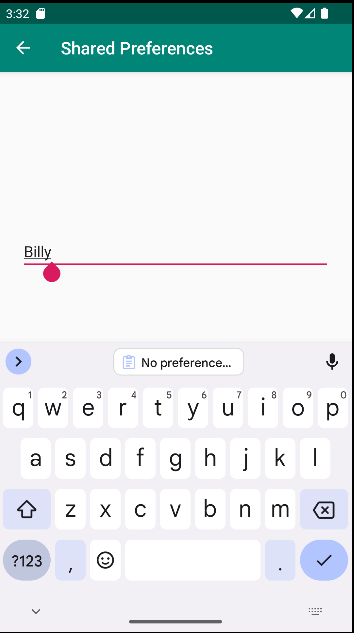

# Rapport

Jag började med att skapa en ny Activity med namnet SecondActivity vars layout jag gav en EditText och en Button som ska kunna spara ett namn.
Jag gav sedan MainActivitys layout en TextView som ska kunna visa namnet och en Button som ska kunna skicka användaren till SecondActivity.
Jag skapade sen en Tillbaka-knapp för SecondActivity genom att definiera MainActivity som dess Parent i AndroidManifest-filen.


Sedan skapade jag en OnclickListener som skickar användaren till SecondActivity när de trycker på knappen i MainActivity.

Kodexempel 1
```
        Button MainButton = findViewById(R.id.MainButton);
        MainButton.setOnClickListener(new View.OnClickListener() {
            @Override
            public void onClick(View view) {
                Intent intent = new Intent(MainActivity.this, SecondActivity.class);
                startActivity(intent);
            }
        });
    }
```
Jag skapade sen en PreferenceRefEditor i SecondActivity som jag definierade att när användaren trycker
på knappen så ska den ta datan som skrivits till min EditText och spara den i min SharedPreference.

Kodexempel 2
```
    SharedPreferences myPreferenceRef;
    SharedPreferences.Editor myPreferenceEditor;
    Button EnterButton;
    EditText EditTextName;


    @Override
    protected void onCreate(Bundle savedInstanceState) {
        super.onCreate(savedInstanceState);
        setContentView(R.layout.activity_second);

        myPreferenceRef = getSharedPreferences("MyPreferencesName", MODE_PRIVATE);
        EnterButton = findViewById(R.id.EnterButton);
        EditTextName = findViewById(R.id.EditTextName);
        EnterButton.setOnClickListener(new View.OnClickListener() {
            @Override
            public void onClick(View view) {
                String name = EditTextName.getText().toString();

                myPreferenceEditor = myPreferenceRef.edit();
                myPreferenceEditor.putString("MyAppPreferenceString",name);
                myPreferenceEditor.apply();
            }
        });

    }
```
Jag skapade också sedan en PreferenceRef i MainActivity som hämtar innehållet i SharedPreference och skriver det till TextViewen.

Kodexempel 3
```
    @Override
    protected void onResume() {
        super.onResume();
        Textview.setText(myPreferenceRef.getString("MyAppPreferenceString", "No preference found."));
    }
```


Figur 1 Ingen data har skrivits till shared preferences. Vi trycker på knappen för att gå till nästa sida.



Figur 2 Vi skriver Ett namn i EditText rutan och trycker på knappen.


Figur 3 Namnet vi skrev har sparats i SharedPreferences och visas nu på första sidan.
